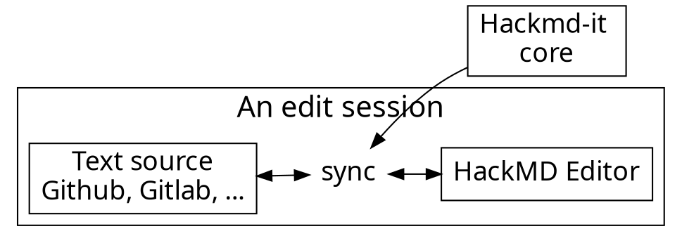

#  我要介紹JOJO

<!-- Put the link to this slide here so people can follow -->
slide: https://www.google.com/imgres?imgurl=https%3A%2F%2Fi.ytimg.com%2Fvi%2Fu9YriiExAwQ%2Fmaxresdefault.jpg&imgrefurl=https%3A%2F%2Fwww.youtube.com%2Fwatch%3Fv%3Du9YriiExAwQ&docid=FDioJLf1FkMcqM&tbnid=S8GrJ2711NpbyM%3A&vet=10ahUKEwja3fuvue7kAhU-yosBHXeHA7AQMwhPKAAwAA..i&w=1280&h=720&bih=693&biw=1340&q=JOJO&ved=0ahUKEwja3fuvue7kAhU-yosBHXeHA7AQMwhPKAAwAA&iact=mrc&uact=8

---

要講JOJO一定要先從幻影血脈講起!
有請......
# **大喬!!!!!**

---

再來有請我們各種騷包車技的老司機
# 二喬!!!

---

再來是我們永遠的龍傲天 有請.....
# 三喬!!!

---


---

### Usage flow

---

### Thank you! :sheep: 

You can find me on

- GitHub
- Twitter
- or email me
